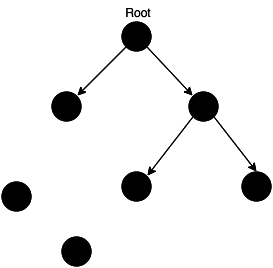
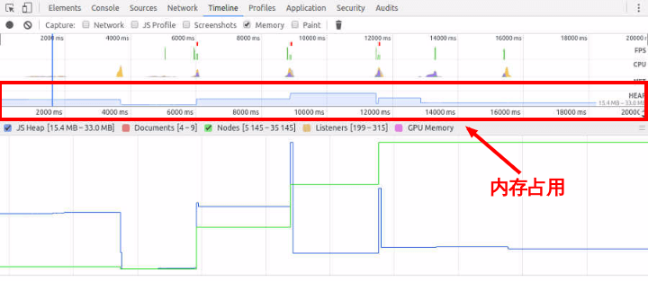

### 目录

* [数组](#数组)
* [防抖与节流](#防抖与节流)
* [内存泄漏](#内存泄漏)


## 数组

### 概要

数组是一组按序排列的值，创建数组的目的通常是遍历数字索引值，以零索引开始。

我们需要了解的是，数组是按照数字顺序排列的集合，相对地，对象的属性名称是无序的。

从本质上讲，数组使用数字作为查找建，而对象拥有用户自定义的属性名。

JavaScript 没有真正的关联数组，对象可用于实现关联数组的功能

如果我们想了解数组中有什么方法和属性，有个很简单的方法——通过浏览器打印 Array

```js
console.dir(Array);
```

除去 arguments、caller、Symbol、get Symbol 以及 [[Scopes]] 外，剩下的都是我们非常熟悉的数组拥有的静态函数，可以看出，有 length、name 等静态属性，还有 from、isArray、of 等静态方法

我们用 Class 来写一下 Array 的伪代码：


```js
class MyArray {
    constructor() {
        this.name = name;
        this.length = arguments.length; // arguments 指参数中的类数组对象
        this.prototype = prototype;
    }
}
MyArray.from = function () {};
MyArray.isArray = function () {};
MyArray.of = function () {};
```

> 这里提一句，用 Class 模拟类(继承)，它的 constructor 函数其实也很好记，它就是用来做属性初始化的，它很特殊，写在 class 中，但不在 prototype 里

### 原型上的属性和方法

在上文已经展示了 Array 的静态属性和方法，但我们知道， JavaScript 是以原型作为继承的语言，也就是说在 「prototype」属性中，拥有了我们平常使用的数组方法

### 实例属性

* index
* length

### 实例方法

* `pop()`：从数组中删除最后一个元素，并返回该原生的值。该方法更改数组的长度
* `push()`：将一个或多个元素添加到数组的末尾，并返回该数组的新长度
* `reverse()`：将数组中原生的位置颠倒，并返回该数组。数组的第一个元素变成最后一个，数组的最后一个元素变成第一个。该方法会改变原数组,所以一般如果你要颠倒一个数组时，先深拷贝先
* `shift()`：从数组中删除第一个元素，并返回该元素的值。此方法更改数组的长度
* `sort()`：用原地算法对数组的元素进行排序，并返回数组。默认排序是在将元素转换为字符串，然后比较他们的 UTF-16 代码单元制序列时构建,由于它取决于具体实现，因此无法保证排序的时间和空间复杂性
* `splice()`：方法通过删除或代替现有元素或者原地添加新的元素来修改数组，并以数组形式返回被修改的内容。此方法会改变原数组,第一个参数，指定修改的开始位置（从 0 计数）
* `unshift()`：将一个或多个元素添加到数组的开头，并返回该数组的新长度（该方法修改原数组）
* `concat()`：方法用于合并或多个数组。此方法不会更改现有数组，而是返回一个新数
* `join()`： 方法将一个数组（或一个类数组对象）的所有元素连接成一个字符串并返回这个字符串。如果数组只有一个项目，那么将返回该项目而不适用分隔符
* `slice()`：方法返回一个新的数组对象，这一对象是一个由 begin 和 end 决定的原数组的浅拷贝（包括begin，不包括end）。原始数组不会被改变
* `isArray()`：用于确定传递的值是否是数组
* `from()`：对一个类似数组或可迭代对象创建一个新的，浅拷贝的数组实例
* `forEach()`：遍历数组中的每个元素
* `filter()`：通过回调函数筛选元素
* `find()`：返回数组中满足提供的测试函数的第一个元素的值
* `some()`：测试数组中是不是至少有 1 个元素通过了被提供的函数测试,它返回的是一个 Boolean 类型的值
* `reduce()`：对数组中的每个元素按序执行一个由您提供的 reducer 函数,每一次运行 reducer 会将先前元素的计算结果作为参数传入，最后将其结果汇总为单个返回值

### 哪些 API 会改变原数组
```js
arr.splice();
arr.sort();
arr.reverse();
arr.fill();
arr.push();
arr.pop();
arr.shift();
arr.unshift();
```

### 哪些 API 不会改变原数组
```js
arr.slice();
arr.concat();
arr.map();
arr.forEach();
arr.fliter();
arr.reduce();
arr.every();
arr.some();
arr.find();
arr.entries();
```


## 防抖与节流


### 防抖

防抖就是要延迟执行，你一直操作触发事件一直不执行，当你停止操作等待多少秒后才执行

也就是说不管事件触发频率有多高，一定在事件触发 n 秒后执行。如果在事件触发的 n 秒又触发了这个事件，那就以新事件的事件为准，n 秒后才执行。总之，要等你触发完事件 n 秒内不再触发事件，它才执行

```js
function debounce(event, wait) {
  let timer = null;
  return function (...args) {
    clearTimeout(timer); // 清除setTimeout，使其回调函数不执行
    timer = setTimeout(() => {
      event.apply(this, args);
    }, wait);
  };
}
```

代码很简单，即当还在触发事件时，就清除 timer，使其在 n 秒后执行，但此写法首次不会立即执行，为其健壮性，需加上判断是否第一次执行的第三个参数 flag，判断其是否立即执行

```js
function debounce(event, wait, flag) {
  let timer = null;
  return function (...args) {
    clearTimeout(timer);
    if (!timer && flag) {
      event.apply(this, args);
    } else {
      timer = setTimeout(() => {
        event.apply(this, args);
      }, wait);
    }
  };
}
```

### 节流

顾名思义，一节一节的流，就好似控制水阀，在事件不断触发的过程中，固定时间内执行一次事件

固定时间内执行一次时间，所以我们有两种实现方法，一用时间戳，二用定时器

```js
function throttle(event, wait) {
  let pre = 0;
  return function (...args) {
    if (new Date() - pre > wait) {
      // 当 n 秒内不重复执行
      pre = new Date();
      event.apply(this, args);
    }
  };
}
```
使用时间戳虽然能实现节流，但是最后一次事件不会执行
```js
function throttle(event, wait) {
  let timer = null;
  return function (...args) {
    if (!timer) {
      timer = setTimeout(() => {
        timer = null;
        event.apply(this, args);
      }, wait);
    }
  };
}
```
使用定时器实现节流，虽然最后一次能触发，但是第一次不会触发

为解决第一次和最后一次都可以触发
```js
function throttle(event, wait) {
  let pre = 0,
    timer = null;
  return function (...args) {
    if (new Date() - pre > wait) {
      clearTimeout(timer);
      timer = null;
      pre = new Date();
      event.apply(this, args);
    } else {
      timer = setTimeout(() => {
        event.apply(this, args);
      }, wait);
    }
  };
}
```

### 总结

防抖：只执行最后一次。事件持续触发，但只有等事件停止触发后 n 秒后才执行函数

节流：控制执行频率。持续触发，每 n 秒执行一次函数

[示例](./examples/demo1.html)

## 内存泄漏

程序的运行需要内存。只要程序提出要求，操作系统或者运行时（runtime）就必须供给内存。

对于持续运行的服务进程（daemon），必须及时释放不再用到的内存。否则，内存占用越来越高，轻则影响系统性能，重则导致进程崩溃。


### 垃圾回收机制

垃圾回收机制怎么知道，哪些内存不再需要呢？

最常使用的方法叫做"引用计数"（reference counting）：语言引擎有一张"引用表"，保存了内存里面所有的资源（通常是各种值）的引用次数。如果一个值的引用次数是0，就表示这个值不再用到了，因此可以将这块内存释放。



上图中，左下角的两个值，没有任何引用，所以可以释放。

如果一个值不再需要了，引用数却不为0，垃圾回收机制无法释放这块内存，从而导致内存泄漏。

```js
const arr = [1, 2, 3, 4];
console.log('hello world');
```
上面代码中，数组[1, 2, 3, 4]是一个值，会占用内存。变量arr是仅有的对这个值的引用，因此引用次数为1。尽管后面的代码没有用到arr，它还是会持续占用内存。

如果增加一行代码，解除arr对[1, 2, 3, 4]引用，这块内存就可以被垃圾回收机制释放了。

```js
let arr = [1, 2, 3, 4];
console.log('hello world');
arr = null;
```
上面代码中，arr重置为null，就解除了对[1, 2, 3, 4]的引用，引用次数变成了0，内存就可以释放出来了。

因此，并不是说有了垃圾回收机制，程序员就轻松了。你还是需要关注内存占用：那些很占空间的值，一旦不再用到，你必须检查是否还存在对它们的引用。如果是的话，就必须手动解除引用。

### 识别方法

怎样可以观察到内存泄漏呢？

经验法则是，如果连续五次垃圾回收之后，内存占用一次比一次大，就有内存泄漏。这就要求实时查看内存占用。



Chrome 浏览器查看内存占用，按照以下步骤操作。

1. 打开开发者工具，选择 Timeline 面板
2. 在顶部的Capture字段里面勾选 Memory
3. 点击左上角的录制按钮。
4. 在页面上进行各种操作，模拟用户的使用情况。
5. 一段时间后，点击对话框的 stop 按钮，面板上就会显示这段时间的内存占用情况。

如果内存占用基本平稳，接近水平，就说明不存在内存泄漏。